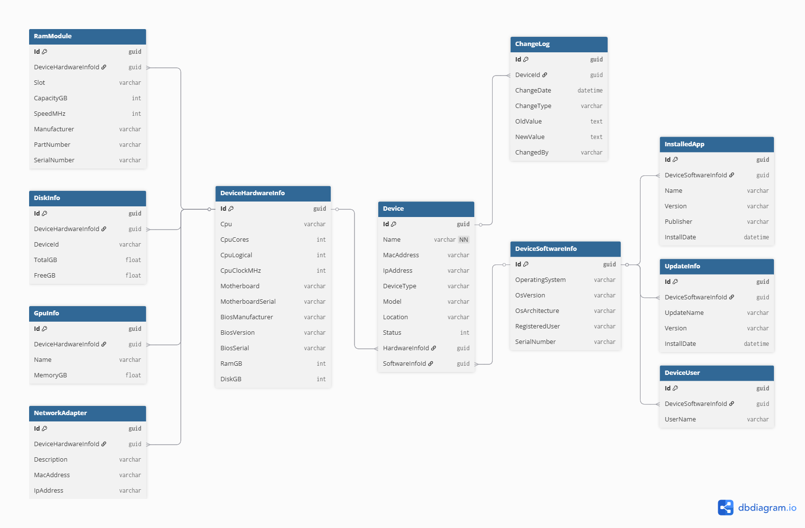

# Inventory Management System - Teknik Dokümantasyon

## İçindekiler
1. [Proje Mimarisi](#proje-mimarisi)
2. [Modüller ve Sorumlulukları](#modüller-ve-sorumlulukları)
3. [Veri Modelleri](#veri-modelleri)
4. [API Endpoint Örnekleri](#api-endpoint-örnekleri)
5. [Loglama ve Diff Mekanizması](#loglama-ve-diff-mekanizması)
6. [Hata Yönetimi](#hata-yönetimi)
7. [Deployment](#deployment)
8. [Test Stratejisi](#test-stratejisi)
9. [Genişletme Önerileri](#genişletme-önerileri)

## Proje Mimarisi

InventoryManagementSystem, .NET 8.0 tabanlı, modüler bir envanter yönetim sistemidir. Sistem, Clean Architecture prensiplerine uygun olarak tasarlanmış, katmanlı bir mimariye sahiptir.

### Genel Mimari

```
┌─────────────────────────────────────────────────────────────┐
│                    Client Applications                      │
│  ┌─────────────────┐  ┌─────────────────┐  ┌─────────────┐ │
│  │ Windows Agent   │  │ Web Interface   │  │ Mobile App  │ │
│  └─────────────────┘  └─────────────────┘  └─────────────┘ │
└─────────────────────────────────────────────────────────────┘
                              │ HTTP/HTTPS
┌─────────────────────────────────────────────────────────────┐
│                    Inventory.Api                            │
│  ┌─────────────────┐  ┌─────────────────┐  ┌─────────────┐ │
│  │ Controllers     │  │ Middlewares     │  │ Services    │ │
│  └─────────────────┘  └─────────────────┘  └─────────────┘ │
└─────────────────────────────────────────────────────────────┘
                              │
┌─────────────────────────────────────────────────────────────┐
│                  Business Logic Layer                      │
│  ┌─────────────────┐  ┌─────────────────┐  ┌─────────────┐ │
│  │ Inventory.Domain│  │ Inventory.Shared│  │ Services    │ │
│  └─────────────────┘  └─────────────────┘  └─────────────┘ │
└─────────────────────────────────────────────────────────────┘
                              │
┌─────────────────────────────────────────────────────────────┐
│                    Data Access Layer                       │
│  ┌─────────────────┐  ┌─────────────────┐  ┌─────────────┐ │
│  │ Inventory.Data  │  │ Repositories    │  │ Database    │ │
│  └─────────────────┘  └─────────────────┘  └─────────────┘ │
└─────────────────────────────────────────────────────────────┘
```

### Teknoloji Stack'i

- **Framework**: .NET 8.0
- **API**: ASP.NET Core Web API
- **Documentation**: Swagger/OpenAPI
- **Serialization**: Newtonsoft.Json
- **Hardware Monitoring**: LibreHardwareMonitor
- **Windows Management**: System.Management (WMI)
- **HTTP Client**: HttpClient

## Modüller ve Sorumlulukları

### 1. Inventory.Domain
Domain katmanı, sistemin temel varlıklarını (entities) ve iş kurallarını içerir.

**Sorumlulukları:**
- Entity tanımlamaları
- Enum tanımlamaları  
- Domain model validasyonları
- İş kuralları

**Ana Sınıflar:**
- `Device`: Ana cihaz entity'si
- `DeviceHardwareInfo`: Donanım bilgileri
- `DeviceSoftwareInfo`: Yazılım bilgileri
- `ChangeLog`: Değişiklik geçmişi
- `DeviceStatus`: Cihaz durumu enum'u

### 2. Inventory.Api
REST API katmanı, HTTP endpoint'leri ve API yönetimini sağlar.

**Sorumlulukları:**
- HTTP endpoint'leri
- Request/Response mapping
- API documentation (Swagger)
- Authentication/Authorization (gelecek)
- API versioning (gelecek)

**Ana Sınıflar:**
- `DeviceController`: Cihaz CRUD operasyonları
- `Program`: API başlangıç konfigürasyonu

### 3. Inventory.Agent.Windows
Windows işletim sistemi için otomatik envanter toplama agent'ı.

**Sorumlulukları:**
- Sistem bilgilerini toplama (WMI)
- Donanım bilgilerini tespit etme
- Yazılım bilgilerini listeleme
- API'ye veri gönderimi
- Yerel loglama ve diff takibi

**Ana Sınıflar:**
- `Program`: Ana agent logic'i
- `ApiClient`: API iletişimi
- `DeviceLogger`: Gelişmiş loglama ve diff sistemi
- `NetworkScanner`: Ağ tarama özellikleri

### 4. Inventory.Data
Veri erişim katmanı (şu anda minimal, genişletilecek).

**Sorumlulukları:**
- Database bağlantıları
- Repository pattern implementasyonu
- Entity Framework konfigürasyonu
- Data migrations

### 5. Inventory.Shared
Ortak kütüphane bileşenleri.

**Sorumlulukları:**
- Ortak utility'ler
- Shared constants
- Cross-cutting concerns
- Common DTOs

## Veri Modelleri

### Veritabanı Yapısı

Aşağıda sistemin veritabanı şema diyagramı yer almaktadır:



### Device Entity

```csharp
public class Device
{
    public Guid Id { get; set; }
    public string Name { get; set; }                    // Cihaz adı
    public string MacAddress { get; set; }              // MAC adresi
    public string IpAddress { get; set; }               // IP adresi
    public string DeviceType { get; set; }              // Cihaz tipi (PC, Server, etc.)
    public string Model { get; set; }                   // Model bilgisi
    public string Location { get; set; }                // Fiziksel konum
    public int Status { get; set; }                     // Cihaz durumu (DeviceStatus enum)
    public List<ChangeLog> ChangeLogs { get; set; }     // Değişiklik geçmişi
    public DeviceHardwareInfo HardwareInfo { get; set; } // Donanım bilgileri
    public DeviceSoftwareInfo SoftwareInfo { get; set; } // Yazılım bilgileri
}
```

### DeviceHardwareInfo Entity

```csharp
public class DeviceHardwareInfo
{
    // CPU Bilgileri
    public string Cpu { get; set; }
    public int CpuCores { get; set; }
    public int CpuLogical { get; set; }
    public int CpuClockMHz { get; set; }
    
    // Anakart ve BIOS Bilgileri
    public string Motherboard { get; set; }
    public string MotherboardSerial { get; set; }
    public string BiosManufacturer { get; set; }
    public string BiosVersion { get; set; }
    public string BiosSerial { get; set; }
    
    // Bellek Bilgileri
    public int RamGB { get; set; }
    public List<RamModule> RamModules { get; set; }
    
    // Disk Bilgileri
    public int DiskGB { get; set; }
    public List<DiskInfo> Disks { get; set; }
    
    // GPU ve Ağ Bilgileri
    public List<GpuInfo> Gpus { get; set; }
    public List<NetworkAdapter> NetworkAdapters { get; set; }
}
```

### DeviceSoftwareInfo Entity

```csharp
public class DeviceSoftwareInfo
{
    // İşletim Sistemi Bilgileri
    public string OperatingSystem { get; set; }
    public string OsVersion { get; set; }
    public string OsArchitecture { get; set; }
    public string RegisteredUser { get; set; }
    public string SerialNumber { get; set; }
    
    // Yazılım ve Kullanıcı Bilgileri
    public List<string> InstalledApps { get; set; }
    public List<string> Updates { get; set; }
    public List<string> Users { get; set; }
    public string ActiveUser { get; set; }
}
```

### DeviceStatus Enum

```csharp
public enum DeviceStatus
{
    Active = 0,      // Aktif kulımda
    Inactive = 1,    // Pasif/kullanım dışı
    Maintenance = 2, // Bakımda
    Retired = 3      // Hizmet dışı
}
```

### ChangeLog Entity

```csharp
public class ChangeLog
{
    public Guid Id { get; set; }
    public DateTime ChangeDate { get; set; }     // Değişiklik tarihi
    public string ChangeType { get; set; }       // Değişiklik türü
    public string OldValue { get; set; }         // Eski değer
    public string NewValue { get; set; }         // Yeni değer
    public string ChangedBy { get; set; }        // Değişikliği yapan
}
```

## API Endpoint Örnekleri

### 1. Tüm Cihazları Listele

**Endpoint:** `GET /api/device`

**Request:**
```http
GET /api/device HTTP/1.1
Host: localhost:7296
Accept: application/json
```

**Response:**
```json
[
    {
        "id": "550e8400-e29b-41d4-a716-446655440000",
        "name": "DESKTOP-ABC123",
        "macAddress": "00:1B:44:11:3A:B7",
        "ipAddress": "192.168.1.100",
        "deviceType": "PC",
        "model": "Dell OptiPlex 7090",
        "location": "Ofis-A-101",
        "status": 0,
        "changeLogs": [],
        "hardwareInfo": {
            "cpu": "Intel Core i7-11700K",
            "cpuCores": 8,
            "cpuLogical": 16,
            "cpuClockMHz": 3600,
            "ramGB": 32,
            "diskGB": 1000
        },
        "softwareInfo": {
            "operatingSystem": "Microsoft Windows 11 Pro",
            "osVersion": "10.0.22631",
            "osArchitecture": "64-bit"
        }
    }
]
```

### 2. Tek Cihaz Getir

**Endpoint:** `GET /api/device/{id}`

**Request:**
```http
GET /api/device/550e8400-e29b-41d4-a716-446655440000 HTTP/1.1
Host: localhost:7296
Accept: application/json
```

**Response:**
```json
{
    "id": "550e8400-e29b-41d4-a716-446655440000",
    "name": "DESKTOP-ABC123",
    "macAddress": "00:1B:44:11:3A:B7",
    "ipAddress": "192.168.1.100",
    "deviceType": "PC",
    "model": "Dell OptiPlex 7090",
    "location": "Ofis-A-101",
    "status": 0,
    "changeLogs": [
        {
            "id": "123e4567-e89b-12d3-a456-426614174000",
            "changeDate": "2024-01-15T10:30:00Z",
            "changeType": "InitialRegistration",
            "oldValue": "",
            "newValue": "Kaydedildi",
            "changedBy": "system"
        }
    ],
    "hardwareInfo": {
        "cpu": "Intel Core i7-11700K",
        "cpuCores": 8,
        "cpuLogical": 16,
        "cpuClockMHz": 3600,
        "motherboard": "Dell Inc. 0M3F6V",
        "motherboardSerial": "..CN7016137H049Q.",
        "biosManufacturer": "Dell Inc.",
        "biosVersion": "2.8.0",
        "biosSerial": "4KMZQR3",
        "ramGB": 32,
        "ramModules": [
            {
                "slot": "BANK 0",
                "capacityGB": 16,
                "speedMHz": "3200",
                "manufacturer": "Samsung",
                "partNumber": "M378A2K43EB1-CWE",
                "serialNumber": "12345678"
            }
        ],
        "diskGB": 1000,
        "disks": [
            {
                "deviceId": "C:",
                "totalGB": 953.87,
                "freeGB": 125.43
            }
        ],
        "gpus": [
            {
                "name": "NVIDIA GeForce RTX 3070",
                "memoryGB": 8.0
            }
        ],
        "networkAdapters": [
            {
                "description": "Intel(R) Ethernet Connection I219-LM",
                "macAddress": "00:1B:44:11:3A:B7",
                "ipAddress": "192.168.1.100"
            }
        ]
    },
    "softwareInfo": {
        "operatingSystem": "Microsoft Windows 11 Pro",
        "osVersion": "10.0.22631",
        "osArchitecture": "64-bit",
        "registeredUser": "John Doe",
        "serialNumber": "00330-80000-00000-AA123",
        "installedApps": [
            "Microsoft Office Professional Plus 2021 16.0.17531.20152",
            "Google Chrome 121.0.6167.185",
            "Adobe Acrobat Reader DC 24.001.20643"
        ],
        "updates": [],
        "users": ["john.doe"],
        "activeUser": "john.doe"
    }
}
```

### 3. Yeni Cihaz Ekle

**Endpoint:** `POST /api/device`

**Request:**
```http
POST /api/device HTTP/1.1
Host: localhost:7296
Content-Type: application/json

{
    "name": "LAPTOP-XYZ789",
    "macAddress": "00:1C:42:00:00:01",
    "ipAddress": "192.168.1.150",
    "deviceType": "Laptop",
    "model": "ThinkPad X1 Carbon",
    "location": "Ev Ofisi",
    "status": 0,
    "hardwareInfo": {
        "cpu": "Intel Core i7-1165G7",
        "cpuCores": 4,
        "cpuLogical": 8,
        "cpuClockMHz": 2800,
        "ramGB": 16,
        "diskGB": 512
    },
    "softwareInfo": {
        "operatingSystem": "Microsoft Windows 11 Pro",
        "osVersion": "10.0.22631",
        "osArchitecture": "64-bit"
    }
}
```

**Response:**
```json
{
    "id": "660e8400-e29b-41d4-a716-446655440001",
    "name": "LAPTOP-XYZ789",
    "macAddress": "00:1C:42:00:00:01",
    "ipAddress": "192.168.1.150",
    "deviceType": "Laptop",
    "model": "ThinkPad X1 Carbon",
    "location": "Ev Ofisi",
    "status": 0,
    "changeLogs": [],
    "hardwareInfo": {
        "cpu": "Intel Core i7-1165G7",
        "cpuCores": 4,
        "cpuLogical": 8,
        "cpuClockMHz": 2800,
        "ramGB": 16,
        "diskGB": 512
    },
    "softwareInfo": {
        "operatingSystem": "Microsoft Windows 11 Pro",
        "osVersion": "10.0.22631",
        "osArchitecture": "64-bit"
    }
}
```

### 4. Cihaz Güncelle

**Endpoint:** `PUT /api/device/{id}`

**Request:**
```http
PUT /api/device/660e8400-e29b-41d4-a716-446655440001 HTTP/1.1
Host: localhost:7296
Content-Type: application/json

{
    "name": "LAPTOP-XYZ789-UPDATED",
    "macAddress": "00:1C:42:00:00:01",
    "ipAddress": "192.168.1.151",
    "deviceType": "Laptop",
    "model": "ThinkPad X1 Carbon Gen 9",
    "location": "Yeni Ofis",
    "status": 0,
    "hardwareInfo": {
        "cpu": "Intel Core i7-1165G7",
        "cpuCores": 4,
        "cpuLogical": 8,
        "cpuClockMHz": 2800,
        "ramGB": 32,
        "diskGB": 1024
    },
    "softwareInfo": {
        "operatingSystem": "Microsoft Windows 11 Pro",
        "osVersion": "10.0.22631",
        "osArchitecture": "64-bit"
    }
}
```

**Response:**
```http
HTTP/1.1 204 No Content
```

### 5. Cihaz Sil

**Endpoint:** `DELETE /api/device/{id}`

**Request:**
```http
DELETE /api/device/660e8400-e29b-41d4-a716-446655440001 HTTP/1.1
Host: localhost:7296
```

**Response:**
```http
HTTP/1.1 204 No Content
```

### HTTP Durum Kodları

| Kod | Açıklama | Kullanım |
|-----|----------|----------|
| 200 | OK | Başarılı GET işlemleri |
| 201 | Created | Başarılı POST (oluşturma) işlemleri |
| 204 | No Content | Başarılı PUT/DELETE işlemleri |
| 400 | Bad Request | Geçersiz request verisi |
| 404 | Not Found | Kaynak bulunamadı |
| 500 | Internal Server Error | Sunucu hatası |

## Loglama ve Diff Mekanizması

InventoryManagementSystem, gelişmiş bir loglama ve değişiklik takip sistemi içerir. Bu sistem, cihaz bilgilerindeki değişiklikleri otomatik olarak tespit eder ve detaylı diff raporları oluşturur.

### Loglama Sistemi Özellikleri

#### 1. Günlük Log Dosyaları
- Her gün için ayrı log dosyası oluşturulur
- Log dosyaları `LocalLogs/device-log-YYYY-MM-DD.json` formatında saklanır
- Sadece son 2 günün logları tutulur (otomatik temizleme)

#### 2. Otomatik Diff Tespit Etme
```csharp
public static void LogDevice(object deviceSnapshot)
{
    // Dünkü log ile karşılaştırma
    if (File.Exists(yesterdayPath))
    {
        var yesterdayJson = File.ReadAllText(yesterdayPath);
        dynamic yesterdayObj = JsonConvert.DeserializeObject(yesterdayJson);
        string yesterdayDeviceJson = JsonConvert.SerializeObject(yesterdayObj.Device);
        string todayDeviceJson = JsonConvert.SerializeObject(deviceSnapshot);

        if (yesterdayDeviceJson != todayDeviceJson)
        {
            diff = GetDetailedDiff(yesterdayDeviceJson, todayDeviceJson);
        }
    }
}
```

#### 3. Detaylı Değişiklik Analizi

Sistem, aşağıdaki kategorilerde değişiklikleri tespit eder:

**Hardware Değişiklikleri:**
- CPU, RAM, Disk değişiklikleri
- GPU ekleme/çıkarma
- RAM modülü değişiklikleri  
- Disk boyutu ve boş alan değişiklikleri
- Ağ adaptörü değişiklikleri

**Software Değişiklikleri:**
- Yüklü uygulama ekleme/çıkarma
- İşletim sistemi güncellemeleri
- Kullanıcı hesabı değişiklikleri
- Aktif kullanıcı değişiklikleri

**Device Bilgi Değişiklikleri:**
- IP adresi değişiklikleri
- Konum değişiklikleri
- Durum değişiklikleri

#### 4. Diff Rapor Formatı

```json
{
    "Date": "2024-01-15T10:30:00Z",
    "Device": { /* Tam cihaz bilgisi */ },
    "Diff": {
        "HardwareInfo.RamModules": {
            "Added": [
                "Slot BANK 2: 16GB Samsung M378A2K43EB1-CWE"
            ],
            "Removed": [],
            "ChangedValues": []
        },
        "SoftwareInfo.InstalledApps": {
            "Added": [
                "Visual Studio Code 1.85.2"
            ],
            "Removed": [
                "Notepad++ 8.5.8"
            ],
            "ChangedValues": []
        },
        "HardwareInfo.Disks": {
            "Added": [],
            "Removed": [],
            "ChangedValues": [
                {
                    "Identifier": "C:",
                    "Changes": [
                        {
                            "Field": "FreeGB",
                            "OldValue": 125.43,
                            "NewValue": 98.71
                        }
                    ]
                }
            ]
        }
    }
}
```

### 5. Diff Sınıf Yapıları

```csharp
public class DetailedDiff
{
    public Dictionary<string, FieldDiff> Diff { get; set; } = new();
}

public class FieldDiff
{
    public List<string> Added { get; set; } = new();
    public List<string> Removed { get; set; } = new();
    public List<object> ChangedValues { get; set; } = new();
}

public class ChangedValue
{
    public string Field { get; set; }
    public object OldValue { get; set; }
    public object NewValue { get; set; }
}

public class ChangedObjectValue
{
    public string Identifier { get; set; }
    public List<ChangedValue> Changes { get; set; } = new();
}
```

### 6. Özel Karşılaştırma Algoritmaları

**RAM Modülü Karşılaştırması:**
```csharp
private static void CompareRamModules(List<RamModuleDto> oldRam, List<RamModuleDto> newRam, DetailedDiff diff)
{
    var oldSlots = oldRam.GroupBy(r => r.Slot).ToDictionary(g => g.Key, g => g.First());
    var newSlots = newRam.GroupBy(r => r.Slot).ToDictionary(g => g.Key, g => g.First());
    
    // Slot bazında karşılaştırma...
}
```

**Disk Karşılaştırması:**
```csharp
private static void CompareDisks(List<DiskInfoDto> oldDisks, List<DiskInfoDto> newDisks, DetailedDiff diff)
{
    var oldDiskMap = oldDisks.ToDictionary(d => d.DeviceId, d => d);
    var newDiskMap = newDisks.ToDictionary(d => d.DeviceId, d => d);
    
    // Device ID bazında karşılaştırma...
}
```

## Hata Yönetimi

### 1. API Hata Yönetimi

**Mevcut Hata Kodları:**
- `404 Not Found`: Cihaz bulunamadığında
- `400 Bad Request`: Geçersiz veri gönderildiğinde
- `500 Internal Server Error`: Sunucu hatalarında

**Örnek Hata Yanıtları:**
```json
{
    "error": "Device not found",
    "details": "Device with ID 550e8400-e29b-41d4-a716-446655440000 does not exist",
    "timestamp": "2024-01-15T10:30:00Z",
    "traceId": "0HN7T5P4MBRK7:00000001"
}
```

### 2. Agent Hata Yönetimi

**WMI Hataları:**
```csharp
try
{
    var softwareSearcher = new ManagementObjectSearcher("SELECT * FROM Win32_Product");
    foreach (ManagementObject obj in softwareSearcher.Get())
    {
        installedApps.Add($"{obj["Name"]} {obj["Version"]}");
    }
}
catch (Exception)
{
    installedApps.Add("Yüklü yazılım listesi alınamadı.");
}
```

**API İletişim Hataları:**
```csharp
public static async Task<bool> PostDeviceAsync(DeviceDto device, string apiUrl)
{
    try
    {
        using (var client = new HttpClient())
        {
            var json = JsonConvert.SerializeObject(device);
            var content = new StringContent(json, Encoding.UTF8, "application/json");
            var response = await client.PostAsync(apiUrl, content);
            var responseString = await response.Content.ReadAsStringAsync();
            Console.WriteLine($"Status: {response.StatusCode}, Response: {responseString}");
            return response.IsSuccessStatusCode;
        }
    }
    catch (Exception ex)
    {
        Console.WriteLine($"API iletişim hatası: {ex.Message}");
        return false;
    }
}
```

### 3. Önerilen Hata Yönetimi Geliştirmeleri

**Global Exception Handler:**
```csharp
public class GlobalExceptionMiddleware
{
    private readonly RequestDelegate _next;
    private readonly ILogger<GlobalExceptionMiddleware> _logger;

    public async Task InvokeAsync(HttpContext context)
    {
        try
        {
            await _next(context);
        }
        catch (Exception ex)
        {
            _logger.LogError(ex, "An unhandled exception occurred");
            await HandleExceptionAsync(context, ex);
        }
    }
}
```

**Structured Logging:**
```csharp
public class DeviceService
{
    private readonly ILogger<DeviceService> _logger;

    public async Task<Device> GetDeviceAsync(Guid id)
    {
        _logger.LogInformation("Getting device with ID: {DeviceId}", id);
        
        try
        {
            // Device getirme logic'i
        }
        catch (Exception ex)
        {
            _logger.LogError(ex, "Error getting device with ID: {DeviceId}", id);
            throw;
        }
    }
}
```

## Deployment

### 1. Geliştirme Ortamı Kurulumu

**Gereksinimler:**
- .NET 8.0 SDK
- Visual Studio 2022 veya VS Code
- Git

**Proje Klonlama ve Çalıştırma:**
```bash
# Repository'yi klonla
git clone https://github.com/hizir-ceylan/InventoryManagementSystem.git
cd InventoryManagementSystem

# Projeyi restore et
dotnet restore

# API'yi çalıştır
cd Inventory.Api
dotnet run

# Agent'ı çalıştır (Windows)
cd ../Inventory.Agent.Windows
dotnet run
```

### 2. API Deployment

**IIS Deployment:**
```bash
# Proje publish et
dotnet publish Inventory.Api -c Release -o ./publish

# IIS'e deploy et
# publish klasörünü IIS site dizinine kopyala
# Application Pool'u .NET 8.0 olarak ayarla
```

**Docker Deployment:**
```dockerfile
# Dockerfile
FROM mcr.microsoft.com/dotnet/aspnet:8.0 AS base
WORKDIR /app
EXPOSE 80
EXPOSE 443

FROM mcr.microsoft.com/dotnet/sdk:8.0 AS build
WORKDIR /src
COPY ["Inventory.Api/Inventory.Api.csproj", "Inventory.Api/"]
COPY ["Inventory.Domain/Inventory.Domain.csproj", "Inventory.Domain/"]
COPY ["Inventory.Data/Inventory.Data.csproj", "Inventory.Data/"]
COPY ["Inventory.Shared/Inventory.Shared.csproj", "Inventory.Shared/"]
RUN dotnet restore "Inventory.Api/Inventory.Api.csproj"
COPY . .
WORKDIR "/src/Inventory.Api"
RUN dotnet build "Inventory.Api.csproj" -c Release -o /app/build

FROM build AS publish
RUN dotnet publish "Inventory.Api.csproj" -c Release -o /app/publish

FROM base AS final
WORKDIR /app
COPY --from=publish /app/publish .
ENTRYPOINT ["dotnet", "Inventory.Api.dll"]
```

**Docker Compose:**
```yaml
version: '3.8'
services:
  inventory-api:
    build: 
      context: .
      dockerfile: Dockerfile
    ports:
      - "8080:80"
      - "8443:443"
    environment:
      - ASPNETCORE_ENVIRONMENT=Production
      - ConnectionStrings__DefaultConnection=Server=db;Database=InventoryDB;User Id=sa;Password=YourPassword123;
    depends_on:
      - db
      
  db:
    image: mcr.microsoft.com/mssql/server:2022-latest
    environment:
      SA_PASSWORD: "YourPassword123"
      ACCEPT_EULA: "Y"
    ports:
      - "1433:1433"
    volumes:
      - sql_data:/var/opt/mssql

volumes:
  sql_data:
```

### 3. Agent Deployment

**Windows Service Olarak Deployment:**
```csharp
// Program.cs güncelleme
public class Program
{
    public static async Task Main(string[] args)
    {
        var isService = !(Debugger.IsAttached || args.Contains("--console"));

        var builder = Host.CreateApplicationBuilder(args);
        builder.Services.AddHostedService<InventoryWorker>();

        if (isService)
        {
            builder.Services.AddWindowsService(options =>
            {
                options.ServiceName = "Inventory Management Agent";
            });
        }

        var host = builder.Build();
        await host.RunAsync();
    }
}
```

**Service kurulumu:**
```bash
# Service olarak kur
sc create "InventoryAgent" binPath="C:\Path\To\Inventory.Agent.Windows.exe"
sc start "InventoryAgent"
```

### 4. Üretim Ortamı Konfigürasyonu

**appsettings.Production.json:**
```json
{
  "Logging": {
    "LogLevel": {
      "Default": "Warning",
      "Microsoft.AspNetCore": "Warning"
    }
  },
  "ConnectionStrings": {
    "DefaultConnection": "Server=prod-db-server;Database=InventoryDB;Trusted_Connection=true;TrustServerCertificate=true;"
  },
  "ApiSettings": {
    "BaseUrl": "https://api.inventory.company.com",
    "Timeout": 30,
    "RetryCount": 3
  },
  "AgentSettings": {
    "ScanInterval": "01:00:00",
    "ApiEndpoint": "https://api.inventory.company.com/api/device",
    "LogRetentionDays": 30
  }
}
```

## Test Stratejisi

### 1. Unit Test Yapısı

**Test Projeleri:**
```
├── Tests/
│   ├── Inventory.Domain.Tests/
│   │   ├── Entities/
│   │   │   ├── DeviceTests.cs
│   │   │   └── ChangeLogTests.cs
│   │   └── Enums/
│   │       └── DeviceStatusTests.cs
│   ├── Inventory.Api.Tests/
│   │   ├── Controllers/
│   │   │   └── DeviceControllerTests.cs
│   │   └── Integration/
│   │       └── ApiIntegrationTests.cs
│   └── Inventory.Agent.Tests/
│       ├── Services/
│       │   ├── HardwareInfoServiceTests.cs
│       │   └── ApiClientTests.cs
│       └── Logging/
│           └── DeviceLoggerTests.cs
```

### 2. DeviceController Unit Tests

```csharp
[TestClass]
public class DeviceControllerTests
{
    private DeviceController _controller;

    [TestInitialize]
    public void Setup()
    {
        _controller = new DeviceController();
    }

    [TestMethod]
    public void GetAll_ShouldReturnEmptyList_WhenNoDevices()
    {
        // Act
        var result = _controller.GetAll();

        // Assert
        var okResult = result.Result as OkObjectResult;
        Assert.IsNotNull(okResult);
        var devices = okResult.Value as IEnumerable<Device>;
        Assert.IsNotNull(devices);
        Assert.AreEqual(0, devices.Count());
    }

    [TestMethod]
    public void Create_ShouldAddDevice_WhenValidDevice()
    {
        // Arrange
        var device = new Device
        {
            Name = "Test Device",
            MacAddress = "00:1B:44:11:3A:B7",
            IpAddress = "192.168.1.100",
            DeviceType = "PC",
            Model = "Test Model",
            Location = "Test Location",
            Status = 0
        };

        // Act
        var result = _controller.Create(device);

        // Assert
        var createdResult = result.Result as CreatedAtActionResult;
        Assert.IsNotNull(createdResult);
        var createdDevice = createdResult.Value as Device;
        Assert.IsNotNull(createdDevice);
        Assert.AreNotEqual(Guid.Empty, createdDevice.Id);
        Assert.AreEqual("Test Device", createdDevice.Name);
    }

    [TestMethod]
    public void GetById_ShouldReturnNotFound_WhenDeviceDoesNotExist()
    {
        // Act
        var result = _controller.GetById(Guid.NewGuid());

        // Assert
        Assert.IsInstanceOfType(result.Result, typeof(NotFoundResult));
    }
}
```

### 3. Integration Tests

```csharp
[TestClass]
public class ApiIntegrationTests
{
    private WebApplicationFactory<Program> _factory;
    private HttpClient _client;

    [TestInitialize]
    public void Setup()
    {
        _factory = new WebApplicationFactory<Program>();
        _client = _factory.CreateClient();
    }

    [TestMethod]
    public async Task GetDevices_ShouldReturnSuccessStatusCode()
    {
        // Act
        var response = await _client.GetAsync("/api/device");

        // Assert
        response.EnsureSuccessStatusCode();
        Assert.AreEqual("application/json; charset=utf-8", 
                       response.Content.Headers.ContentType.ToString());
    }

    [TestMethod]
    public async Task PostDevice_ShouldCreateDevice_WhenValidData()
    {
        // Arrange
        var device = new
        {
            Name = "Integration Test Device",
            MacAddress = "00:1B:44:11:3A:B7",
            IpAddress = "192.168.1.100",
            DeviceType = "PC",
            Model = "Test Model",
            Location = "Test Location",
            Status = 0
        };

        var json = JsonConvert.SerializeObject(device);
        var content = new StringContent(json, Encoding.UTF8, "application/json");

        // Act
        var response = await _client.PostAsync("/api/device", content);

        // Assert
        Assert.AreEqual(HttpStatusCode.Created, response.StatusCode);
        
        var responseContent = await response.Content.ReadAsStringAsync();
        var createdDevice = JsonConvert.DeserializeObject<Device>(responseContent);
        Assert.IsNotNull(createdDevice);
        Assert.AreNotEqual(Guid.Empty, createdDevice.Id);
    }

    [TestCleanup]
    public void Cleanup()
    {
        _client?.Dispose();
        _factory?.Dispose();
    }
}
```

### 4. DeviceLogger Tests

```csharp
[TestClass]
public class DeviceLoggerTests
{
    private string _testLogFolder;

    [TestInitialize]
    public void Setup()
    {
        _testLogFolder = Path.Combine(Path.GetTempPath(), "TestLogs", Guid.NewGuid().ToString());
        Directory.CreateDirectory(_testLogFolder);
    }

    [TestMethod]
    public void LogDevice_ShouldCreateLogFile_WhenDeviceProvided()
    {
        // Arrange
        var device = new DeviceDto
        {
            Name = "Test Device",
            MacAddress = "00:1B:44:11:3A:B7",
            IpAddress = "192.168.1.100"
        };

        // Act
        DeviceLogger.LogDevice(device);

        // Assert
        var todayFile = Path.Combine(_testLogFolder, $"device-log-{DateTime.Now:yyyy-MM-dd}.json");
        Assert.IsTrue(File.Exists(todayFile));
        
        var logContent = File.ReadAllText(todayFile);
        Assert.IsTrue(logContent.Contains("Test Device"));
    }

    [TestCleanup]
    public void Cleanup()
    {
        if (Directory.Exists(_testLogFolder))
        {
            Directory.Delete(_testLogFolder, true);
        }
    }
}
```

### 5. Test Çalıştırma

```bash
# Tüm testleri çalıştır
dotnet test

# Specific test projesini çalıştır  
dotnet test Tests/Inventory.Api.Tests/

# Code coverage ile çalıştır
dotnet test --collect:"XPlat Code Coverage"

# Test sonuçlarını XML formatında al
dotnet test --logger:trx --results-directory ./TestResults
```

### 6. Mock Kullanımı

```csharp
[TestClass]
public class ApiClientTests
{
    [TestMethod]
    public async Task PostDeviceAsync_ShouldReturnTrue_WhenApiReturnsSuccess()
    {
        // Arrange
        var mockHandler = new Mock<HttpMessageHandler>();
        mockHandler.Protected()
            .Setup<Task<HttpResponseMessage>>("SendAsync", 
                ItExpr.IsAny<HttpRequestMessage>(), 
                ItExpr.IsAny<CancellationToken>())
            .ReturnsAsync(new HttpResponseMessage
            {
                StatusCode = HttpStatusCode.Created,
                Content = new StringContent("{\"id\":\"123\"}")
            });

        var client = new HttpClient(mockHandler.Object);
        var device = new DeviceDto { Name = "Test" };

        // Act
        var result = await ApiClient.PostDeviceAsync(device, "http://test.com");

        // Assert
        Assert.IsTrue(result);
    }
}
```

## Genişletme Önerileri

### 1. Veritabanı Entegrasyonu

**Entity Framework Core Implementasyonu:**

```csharp
// DbContext
public class InventoryDbContext : DbContext
{
    public DbSet<Device> Devices { get; set; }
    public DbSet<ChangeLog> ChangeLogs { get; set; }
    
    protected override void OnModelCreating(ModelBuilder modelBuilder)
    {
        modelBuilder.Entity<Device>(entity =>
        {
            entity.HasKey(e => e.Id);
            entity.Property(e => e.Name).IsRequired().HasMaxLength(200);
            entity.Property(e => e.MacAddress).HasMaxLength(17);
            entity.HasMany(e => e.ChangeLogs)
                  .WithOne()
                  .HasForeignKey("DeviceId");
        });
    }
}

// Repository Pattern
public interface IDeviceRepository
{
    Task<IEnumerable<Device>> GetAllAsync();
    Task<Device> GetByIdAsync(Guid id);
    Task<Device> CreateAsync(Device device);
    Task UpdateAsync(Device device);
    Task DeleteAsync(Guid id);
}

public class DeviceRepository : IDeviceRepository
{
    private readonly InventoryDbContext _context;
    
    public DeviceRepository(InventoryDbContext context)
    {
        _context = context;
    }
    
    public async Task<IEnumerable<Device>> GetAllAsync()
    {
        return await _context.Devices
            .Include(d => d.ChangeLogs)
            .Include(d => d.HardwareInfo)
            .Include(d => d.SoftwareInfo)
            .ToListAsync();
    }
    
    // Diğer methodlar...
}
```

### 2. Authentication ve Authorization

**JWT Token Implementasyonu:**

```csharp
// JWT Service
public interface IJwtService
{
    string GenerateToken(User user);
    bool ValidateToken(string token);
}

public class JwtService : IJwtService
{
    private readonly IConfiguration _configuration;
    
    public string GenerateToken(User user)
    {
        var tokenHandler = new JwtSecurityTokenHandler();
        var key = Encoding.ASCII.GetBytes(_configuration["Jwt:Secret"]);
        var tokenDescriptor = new SecurityTokenDescriptor
        {
            Subject = new ClaimsIdentity(new[]
            {
                new Claim(ClaimTypes.NameIdentifier, user.Id.ToString()),
                new Claim(ClaimTypes.Name, user.Username),
                new Claim(ClaimTypes.Role, user.Role)
            }),
            Expires = DateTime.UtcNow.AddHours(24),
            SigningCredentials = new SigningCredentials(
                new SymmetricSecurityKey(key), 
                SecurityAlgorithms.HmacSha256Signature)
        };
        
        var token = tokenHandler.CreateToken(tokenDescriptor);
        return tokenHandler.WriteToken(token);
    }
}

// Controller Authorization
[ApiController]
[Route("api/[controller]")]
[Authorize]
public class DeviceController : ControllerBase
{
    [HttpGet]
    [Authorize(Roles = "Admin,User")]
    public async Task<ActionResult<IEnumerable<Device>>> GetAll()
    {
        // Implementation
    }
    
    [HttpPost]
    [Authorize(Roles = "Admin")]
    public async Task<ActionResult<Device>> Create(Device device)
    {
        // Implementation
    }
}
```

### 3. Real-time Notifications

**SignalR Implementasyonu:**

```csharp
// SignalR Hub
public class InventoryHub : Hub
{
    public async Task JoinGroup(string groupName)
    {
        await Groups.AddToGroupAsync(Context.ConnectionId, groupName);
    }
    
    public async Task LeaveGroup(string groupName)
    {
        await Groups.RemoveFromGroupAsync(Context.ConnectionId, groupName);
    }
}

// Notification Service
public interface INotificationService
{
    Task NotifyDeviceAdded(Device device);
    Task NotifyDeviceUpdated(Device device);
    Task NotifyDeviceDeleted(Guid deviceId);
}

public class NotificationService : INotificationService
{
    private readonly IHubContext<InventoryHub> _hubContext;
    
    public async Task NotifyDeviceAdded(Device device)
    {
        await _hubContext.Clients.All.SendAsync("DeviceAdded", device);
    }
    
    public async Task NotifyDeviceUpdated(Device device)
    {
        await _hubContext.Clients.All.SendAsync("DeviceUpdated", device);
    }
}
```

### 4. Gelişmiş Raporlama

**Reporting Controller:**

```csharp
[ApiController]
[Route("api/[controller]")]
public class ReportsController : ControllerBase
{
    [HttpGet("hardware-summary")]
    public async Task<ActionResult<HardwareSummaryReport>> GetHardwareSummary()
    {
        // CPU, RAM, Disk istatistikleri
    }
    
    [HttpGet("software-inventory")]
    public async Task<ActionResult<SoftwareInventoryReport>> GetSoftwareInventory()
    {
        // Yüklü yazılım analizi
    }
    
    [HttpGet("change-history/{deviceId}")]
    public async Task<ActionResult<List<ChangeLog>>> GetChangeHistory(Guid deviceId)
    {
        // Cihaz değişiklik geçmişi
    }
    
    [HttpGet("export/excel")]
    public async Task<IActionResult> ExportToExcel()
    {
        // Excel export
        using var package = new ExcelPackage();
        // Excel oluşturma logic'i
        return File(package.GetAsByteArray(), 
                   "application/vnd.openxmlformats-officedocument.spreadsheetml.sheet",
                   "inventory-report.xlsx");
    }
}
```

### 5. Caching Stratejisi

**Redis Cache Implementasyonu:**

```csharp
// Cache Service
public interface ICacheService
{
    Task<T> GetAsync<T>(string key);
    Task SetAsync<T>(string key, T value, TimeSpan expiration);
    Task RemoveAsync(string key);
}

public class RedisCacheService : ICacheService
{
    private readonly IDatabase _database;
    
    public async Task<T> GetAsync<T>(string key)
    {
        var value = await _database.StringGetAsync(key);
        return value.HasValue ? JsonConvert.DeserializeObject<T>(value) : default(T);
    }
    
    public async Task SetAsync<T>(string key, T value, TimeSpan expiration)
    {
        var serializedValue = JsonConvert.SerializeObject(value);
        await _database.StringSetAsync(key, serializedValue, expiration);
    }
}

// Controller'da kullanım
public class DeviceController : ControllerBase
{
    private readonly ICacheService _cache;
    
    [HttpGet]
    public async Task<ActionResult<IEnumerable<Device>>> GetAll()
    {
        var cacheKey = "all-devices";
        var cachedDevices = await _cache.GetAsync<IEnumerable<Device>>(cacheKey);
        
        if (cachedDevices != null)
            return Ok(cachedDevices);
            
        var devices = await _deviceRepository.GetAllAsync();
        await _cache.SetAsync(cacheKey, devices, TimeSpan.FromMinutes(5));
        
        return Ok(devices);
    }
}
```

### 6. Health Checks

**Health Check Implementasyonu:**

```csharp
// Health Checks
public class DatabaseHealthCheck : IHealthCheck
{
    private readonly InventoryDbContext _context;
    
    public async Task<HealthCheckResult> CheckHealthAsync(
        HealthCheckContext context, 
        CancellationToken cancellationToken = default)
    {
        try
        {
            await _context.Database.CanConnectAsync(cancellationToken);
            return HealthCheckResult.Healthy("Database connection successful");
        }
        catch (Exception ex)
        {
            return HealthCheckResult.Unhealthy("Database connection failed", ex);
        }
    }
}

// Startup'ta kayıt
builder.Services.AddHealthChecks()
    .AddCheck<DatabaseHealthCheck>("database")
    .AddCheck("api", () => HealthCheckResult.Healthy("API is running"));

app.MapHealthChecks("/health", new HealthCheckOptions
{
    ResponseWriter = UIResponseWriter.WriteHealthCheckUIResponse
});
```

### 7. Background Services

**Scheduled Tasks:**

```csharp
public class InventoryCleanupService : BackgroundService
{
    private readonly IServiceProvider _serviceProvider;
    private readonly ILogger<InventoryCleanupService> _logger;
    
    protected override async Task ExecuteAsync(CancellationToken stoppingToken)
    {
        while (!stoppingToken.IsCancellationRequested)
        {
            using var scope = _serviceProvider.CreateScope();
            var context = scope.ServiceProvider.GetRequiredService<InventoryDbContext>();
            
            // Eski log kayıtlarını temizle
            var cutoffDate = DateTime.UtcNow.AddDays(-90);
            var oldLogs = await context.ChangeLogs
                .Where(l => l.ChangeDate < cutoffDate)
                .ToListAsync();
                
            context.ChangeLogs.RemoveRange(oldLogs);
            await context.SaveChangesAsync();
            
            _logger.LogInformation("Cleanup completed. Removed {Count} old log entries", oldLogs.Count);
            
            // 24 saat bekle
            await Task.Delay(TimeSpan.FromHours(24), stoppingToken);
        }
    }
}
```

### 8. API Versioning

**Version Management:**

```csharp
// API Versioning
builder.Services.AddApiVersioning(opt =>
{
    opt.DefaultApiVersion = new ApiVersion(1, 0);
    opt.AssumeDefaultVersionWhenUnspecified = true;
    opt.ApiVersionReader = ApiVersionReader.Combine(
        new UrlSegmentApiVersionReader(),
        new QueryStringApiVersionReader("version"),
        new HeaderApiVersionReader("X-Version"),
        new MediaTypeApiVersionReader("ver")
    );
});

// Versioned Controller
[ApiController]
[ApiVersion("1.0")]
[ApiVersion("2.0")]
[Route("api/v{version:apiVersion}/[controller]")]
public class DeviceController : ControllerBase
{
    [HttpGet]
    [MapToApiVersion("1.0")]
    public async Task<ActionResult<IEnumerable<DeviceV1>>> GetAllV1()
    {
        // V1 implementation
    }
    
    [HttpGet]
    [MapToApiVersion("2.0")]
    public async Task<ActionResult<IEnumerable<DeviceV2>>> GetAllV2()
    {
        // V2 implementation with additional fields
    }
}
```

### 9. Multi-Platform Agent Support

**Cross-Platform Agent:**

```csharp
// Platform Detection Service
public interface IPlatformService
{
    bool IsWindows { get; }
    bool IsLinux { get; }
    bool IsMacOS { get; }
    Task<DeviceInfo> GetDeviceInfoAsync();
}

public class WindowsPlatformService : IPlatformService
{
    public bool IsWindows => RuntimeInformation.IsOSPlatform(OSPlatform.Windows);
    
    public async Task<DeviceInfo> GetDeviceInfoAsync()
    {
        // Windows specific implementation using WMI
    }
}

public class LinuxPlatformService : IPlatformService
{
    public bool IsLinux => RuntimeInformation.IsOSPlatform(OSPlatform.Linux);
    
    public async Task<DeviceInfo> GetDeviceInfoAsync()
    {
        // Linux specific implementation using system commands
    }
}
```

### 10. Güvenlik Geliştirmeleri

**Security Headers ve Middleware:**

```csharp
// Security Middleware
public class SecurityHeadersMiddleware
{
    private readonly RequestDelegate _next;
    
    public async Task InvokeAsync(HttpContext context)
    {
        context.Response.Headers.Add("X-Content-Type-Options", "nosniff");
        context.Response.Headers.Add("X-Frame-Options", "DENY");
        context.Response.Headers.Add("X-XSS-Protection", "1; mode=block");
        context.Response.Headers.Add("Strict-Transport-Security", "max-age=31536000");
        
        await _next(context);
    }
}

// Input Validation
public class CreateDeviceRequest
{
    [Required]
    [StringLength(200, MinimumLength = 1)]
    public string Name { get; set; }
    
    [RegularExpression(@"^([0-9A-Fa-f]{2}[:-]){5}([0-9A-Fa-f]{2})$")]
    public string MacAddress { get; set; }
    
    [RegularExpression(@"^(?:[0-9]{1,3}\.){3}[0-9]{1,3}$")]
    public string IpAddress { get; set; }
}
```

Bu genişletme önerileri, sistem'in üretim ortamında kullanılabilir, güvenli ve ölçeklenebilir bir hale getirmek için gerekli temel bileşenleri içermektedir.
